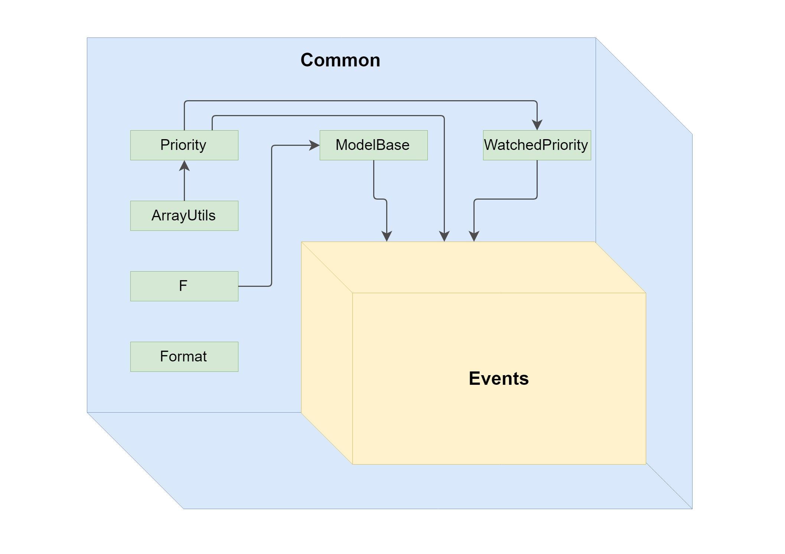
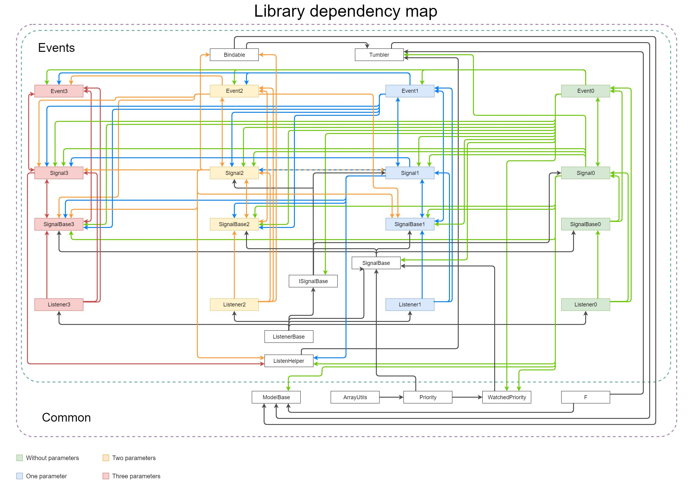
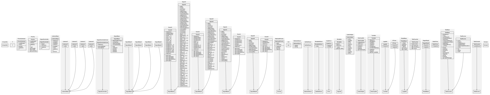

# TypeScript Pony Library - ts-pony

TypeScript version of Haxe Pony library - https://github.com/AxGord/Pony

Github - https://github.com/AxGord/ts-pony

Npm - https://www.npmjs.com/package/ts-pony

